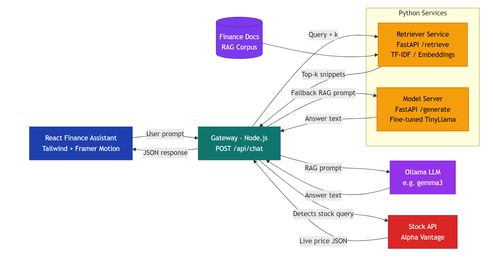

# 💰 Finance AI Chatbot

**Hybrid LLM + RAG + Live Market Data System**

A **production-style finance chatbot** built using a **hybrid AI architecture** that combines:

* 🤖 Fine-tuned local finance LLM
* 📚 Retrieval-Augmented Generation (RAG)
* 🔁 LLM fallback via Ollama
* 📈 Live stock market APIs
* ⚡ React + Node.js + Python microservices
* 🐳 Fully Dockerized setup

This project demonstrates **real-world AI system design**, including **timeouts, fallbacks, orchestration, and scalability**.

---

## 🏗️ System Architecture

The system follows a modular microservices architecture with RAG, local LLMs, and live market data integration:



**Key Components:**

- **React Finance Assistant** (Frontend): Interactive chat UI with Tailwind CSS and Framer Motion
- **Gateway (Node.js)**: Central API hub routing requests via `POST /api/chat`
- **Retriever Service** (Python/FastAPI): Document retrieval using embeddings and TF-IDF from the Finance Docs RAG Corpus
- **Model Server** (Python/FastAPI): Fine-tuned TinyLlama for response generation
- **Finance Docs RAG Corpus**: Indexed document database for context-aware answers
- **External Integrations**:
  - Ollama LLM (e.g., gemma3, mistral) as fallback for complex queries
  - Alpha Vantage Stock API for live market prices
  - Query-driven top-k document snippet retrieval

---

## 🚀 Why This Project?

Local AI models are often:

* Slow under load
* Memory intensive
* Not always reliable

This system ensures:

* ✅ **Always returns an answer**
* ⏱️ **Timeout-aware model switching**
* 📊 **Supports real-time financial data**
* 🔒 **Privacy-first local inference**
* 🧩 **Clean microservice separation**

---

## 🧠 Architecture Explanation

### 1️⃣ React Finance Assistant (Frontend)

* Built using **React + Tailwind CSS + Framer Motion**
* Provides a premium chat UI
* Displays:

  * Answer
  * Source (Local LLM / Ollama / Live API)
  * Timestamp

---

### 2️⃣ Gateway Service (Node.js – Brain of the System)

* Endpoint: `POST /api/chat`
* Responsibilities:

  * Query classification
  * Timeout handling
  * Routing to correct service
  * Fallback orchestration
  * Response normalization

**This service decides *how* and *where* a question should be answered.**

---

### 3️⃣ Retriever Service (Python – RAG Layer)

* Built with **FastAPI**
* Uses **TF-IDF / Embeddings**
* Fetches **Top-K finance document snippets**
* Improves accuracy for:

  * Accounting concepts
  * Finance theory
  * Definitions

---

### 4️⃣ Finance Docs RAG Corpus

* Curated finance knowledge base
* Contains:

  * Corporate finance basics
  * Accounting terms
  * Market concepts
* Used for **grounded generation**

---

### 5️⃣ Model Server (Python – Primary LLM)

* Built with **FastAPI**
* Loads **fine-tuned TinyLlama (Finance-specific)**
* Uses **4-bit quantization**
* Primary responder for finance questions

---

### 6️⃣ Ollama LLM (Fallback Layer)

* Local LLM runner (e.g. `gemma3`, `mistral`)
* Used when:

  * Primary model is slow
  * Model server times out
* Guarantees **high availability**

---

### 7️⃣ Stock Market API (Live Data Layer)

* Uses **Alpha Vantage / Yahoo Finance**
* Triggered when:

  * Stock prices
  * Market data
  * Real-time finance queries are detected
* Returns live JSON responses

---

## 🔄 End-to-End Request Flow

1. User asks a question in the UI
2. React sends request → Node Gateway
3. Gateway classifies the query
4. If **finance theory**:

   * Retriever → RAG prompt → Local LLM
5. If **model is slow**:

   * Fallback → Ollama
6. If **live stock query**:

   * Fetch data from Stock API
7. Final answer returned to UI with source label

---

## 📁 Repository Structure

```
Finance/
│
├── client/          # React frontend (Vite)
├── gateway/         # Node.js orchestration layer
├── model-server/    # Python LLM inference service
├── retriever/       # Vector search / RAG service
├── docker-compose.yml
└── README.md
```

---

## 🚀 Quick Start (Docker – Recommended)

### Prerequisites

* Docker
* Docker Compose

### Setup environment

```bash
cp .env.example .env
```

### Run all services

```bash
docker compose up --build
```

### Access

* Frontend → [http://localhost:5173](http://localhost:5173)
* Gateway → [http://localhost:3001](http://localhost:3001)
* Model Server → [http://localhost:8001](http://localhost:8001)

### 🐳 Ollama (Included)

* Ollama runs automatically via Docker.
* No manual setup required.

* Used as a fallback LLM for reliability.

---

## 🛠️ Local Development (Without Docker)

### Frontend

```bash
cd client
npm install
npm run dev
```

### Gateway

```bash
cd gateway
npm install
node src/index.js
```

### Model Server

```bash
cd model-server
pip install -r requirements.txt
python app.py
```

### Retriever

```bash
cd retriever
pip install -r requirements.txt
python indexer.py
python app.py
```

### ⚠️ Ollama must be running locally:
```bash 
ollama serve
```

---

## 🧪 Debugging

```bash
docker compose logs -f gateway
docker compose logs -f model-server
```

---

## 🔐 Security & Best Practices

* `.env` files ignored
* .env.example provided
* No API keys committed
* No model weights in repo

---

## 🔮 Future Enhancements

* 📈 Real-time stock charts
* 🧠 Smarter query classification (ML-based)
* ⚡ Streaming token responses
* 🗃️ Persistent chat history
* 👤 User authentication
* ☁️ Cloud deployment (AWS/GCP)
* 📊 Multi-API market aggregation
* 📱 Mobile-first UI

---

## 📄 License

Add a license before public release (MIT recommended).

